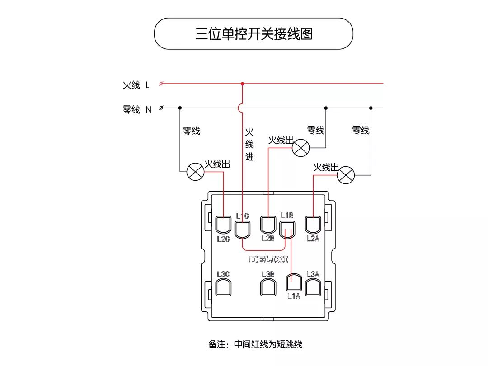
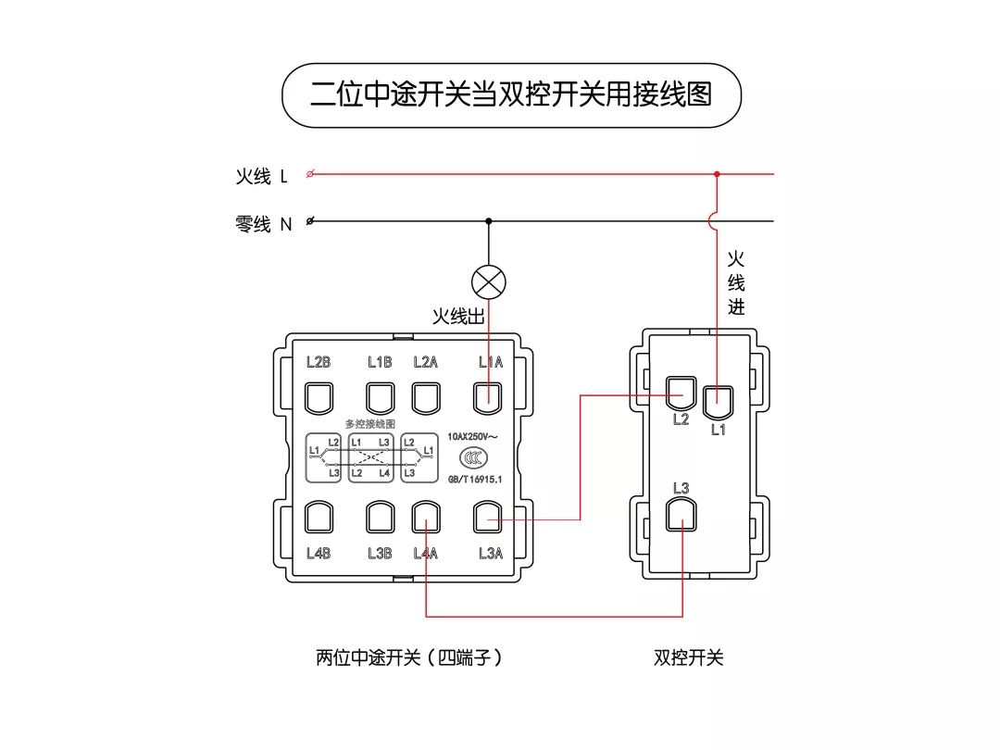

# 电器电路
## 插座
### 接线图
> 原地址:https://mp.weixin.qq.com/s/c5IlwJVRSdgFz105OgPYpQ

一位单控形状接线图

一位双控开关接线图

双控开关电路原理图

二位单控开关接线图

三位单控开关接线图

四位单控开关接线图

五孔插座接线图

一开五孔/一开三插16A插座接线图(开关不控制插座)

一开五孔/一开三插16A插座接线图(开关控制插座)

二开五孔插座接线图(开关不控制插座)

二开五孔插座接线图(开关控制插座)

中途开关(四端子)接线图

中途开关(四端子)电路原理图

中途开关(六端子)接线图

中途开关(六端子)电路原理图

二位多控开关接线图

多只中途开关(四端子)电路原理图

二位中途开关当双控开关用接线图

中途开关(四端子)当双控开关用电路原理图

二位双控开关接线图

三位双控开关接线图

四位双控开关接线图

三位多控开关接线图

